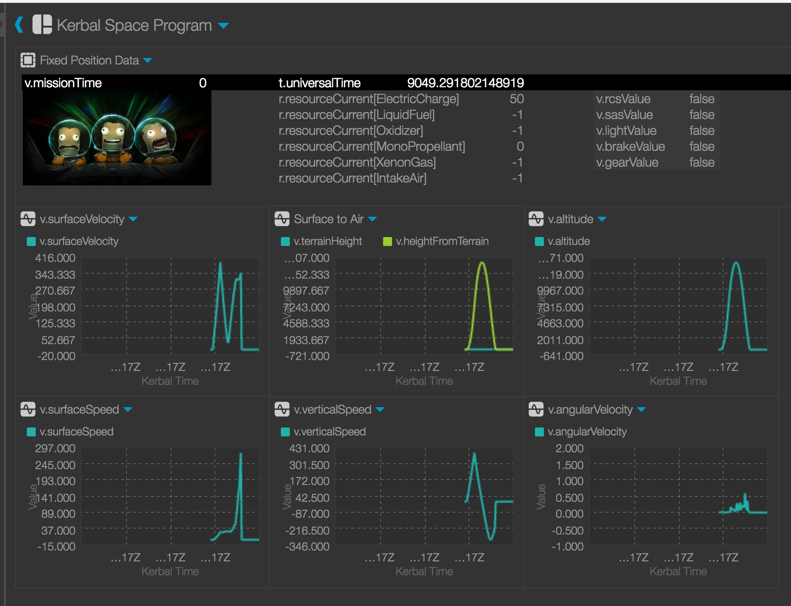

# Open MCT Plugin for Kerbal Space Program

Integrate Telemachus telemetry data into NASA's Open MCT.



## Table of Contents

* [Getting Started](#getting-started)
* [System Requirements](#system-requirements)
* [Disclaimer](#disclaimer)
* [Contributing](#contributing)
* [Thanks](#thanks)

## Getting Started

1. Follow [this guide](https://github.com/nasa/openmct/blob/master/README.md) on setting up Open MCT on your local machine.

2. Follow [this guide](https://github.com/KSP-Telemachus/Telemachus/blob/master/readme.md) on setting up the Telemachus plugin with Kerbal Space Program.

3. From the root directory of your Open MCT installation, clone this repository into ./example/kerbal

4. Edit the main.js file in the root of your Open MCT installation and add the Kerbal bundle to the list of dependencies:
```diff
/*****************************************************************************
 * Open MCT, Copyright (c) 2014-2016, United States Government
 * as represented by the Administrator of the National Aeronautics and Space
 * Administration. All rights reserved.
 *
 * Open MCT is licensed under the Apache License, Version 2.0 (the
 * "License"); you may not use this file except in compliance with the License.
 * You may obtain a copy of the License at
 * http://www.apache.org/licenses/LICENSE-2.0.
 *
 * Unless required by applicable law or agreed to in writing, software
 * distributed under the License is distributed on an "AS IS" BASIS, WITHOUT
 * WARRANTIES OR CONDITIONS OF ANY KIND, either express or implied. See the
 * License for the specific language governing permissions and limitations
 * under the License.
 *
 * Open MCT includes source code licensed under additional open source
 * licenses. See the Open Source Licenses file (LICENSES.md) included with
 * this source code distribution or the Licensing information page available
 * at runtime from the About dialog for additional information.
 *****************************************************************************/
/*global requirejs*/

requirejs.config({
    "paths": {
        "legacyRegistry": "src/legacyRegistry",
        "angular": "bower_components/angular/angular.min",
        "angular-route": "bower_components/angular-route/angular-route.min",
        "csv": "bower_components/comma-separated-values/csv.min",
        "es6-promise": "bower_components/es6-promise/promise.min",
        "moment": "bower_components/moment/moment",
        "moment-duration-format": "bower_components/moment-duration-format/lib/moment-duration-format",
        "saveAs": "bower_components/FileSaver.js/FileSaver.min",
        "screenfull": "bower_components/screenfull/dist/screenfull.min",
        "text": "bower_components/text/text",
        "uuid": "bower_components/node-uuid/uuid",
        "zepto": "bower_components/zepto/zepto.min"
    },
    "shim": {
        "angular": {
            "exports": "angular"
        },
        "angular-route": {
            "deps": ["angular"]
        },
        "moment-duration-format": {
            "deps": ["moment"]
        },
        "screenfull": {
            "exports": "screenfull"
        },
        "zepto": {
            "exports": "Zepto"
        }
    }
});

define([
    './platform/framework/src/Main',
    'legacyRegistry',

    './platform/framework/bundle',
    './platform/core/bundle',
    './platform/representation/bundle',
    './platform/commonUI/about/bundle',
    './platform/commonUI/browse/bundle',
    './platform/commonUI/edit/bundle',
    './platform/commonUI/dialog/bundle',
    './platform/commonUI/formats/bundle',
    './platform/commonUI/general/bundle',
    './platform/commonUI/inspect/bundle',
    './platform/commonUI/mobile/bundle',
    './platform/commonUI/themes/espresso/bundle',
    './platform/commonUI/notification/bundle',
    './platform/containment/bundle',
    './platform/execution/bundle',
    './platform/exporters/bundle',
    './platform/telemetry/bundle',
    './platform/features/clock/bundle',
    './platform/features/fixed/bundle',
    './platform/features/imagery/bundle',
    './platform/features/layout/bundle',
    './platform/features/pages/bundle',
    './platform/features/plot/bundle',
    './platform/features/timeline/bundle',
    './platform/features/table/bundle',
    './platform/forms/bundle',
    './platform/identity/bundle',
    './platform/persistence/aggregator/bundle',
    './platform/persistence/local/bundle',
    './platform/persistence/queue/bundle',
    './platform/policy/bundle',
    './platform/entanglement/bundle',
    './platform/search/bundle',
    './platform/status/bundle',
+   './platform/commonUI/regions/bundle',
+   './example/kerbal/bundle'
], function (Main, legacyRegistry) {
    return {
        legacyRegistry: legacyRegistry,
        run: function () {
            return new Main().run(legacyRegistry);
        }
    };
});
```

5. Open Kerbal Space Program and assemble a ship

6. Put your assembled ship on the launch pad

7. In your browser, go to [http://localhost:8080](http://localhost:8080)
 
8. Click around the Kerbal Spacecraft node to get familiar with the types of telemetry data available
 
9. Say out-loud "3... 2... 1... lift off!" while launching your ship

10. Watch telemetry data populate for your ship, while noticing the understandable looks of jealousy from family and friends

## System Requirements

This package has been tested with:

* Telemachus 1.5
* KSP v1.1.3.1289
* Mac OS X 10.11.6.

_Your mileage may vary._

## Disclaimer

I am not responsible for the death of any Kerbalians while attempting to get this to work. Use at your own risk.

## Contributing

I wrote this plugin as an example for those that would like to add new telemetry sources to Open MCT in a rare moment of free-time. I will update it as often as time allows, but would greatly appreciate contributions via pull-requests from fellow enthusiasts.
  
For consistency, please follow the contribution guidelines of Open MCT when contributing to this repo.

## Thanks

A HUGE thank you to the folks at NASA Ames Research Center for open-sourcing their mission control software. This is an incredible time to be alive. I nearly passed out with joy (also _I had been drinking_) when I had real mission control software running on my personal laptop. That's crazy!

A further HUGE thank you goes out to the makers of Kerbal Space Program and the Telemachus plugin. Great work!
